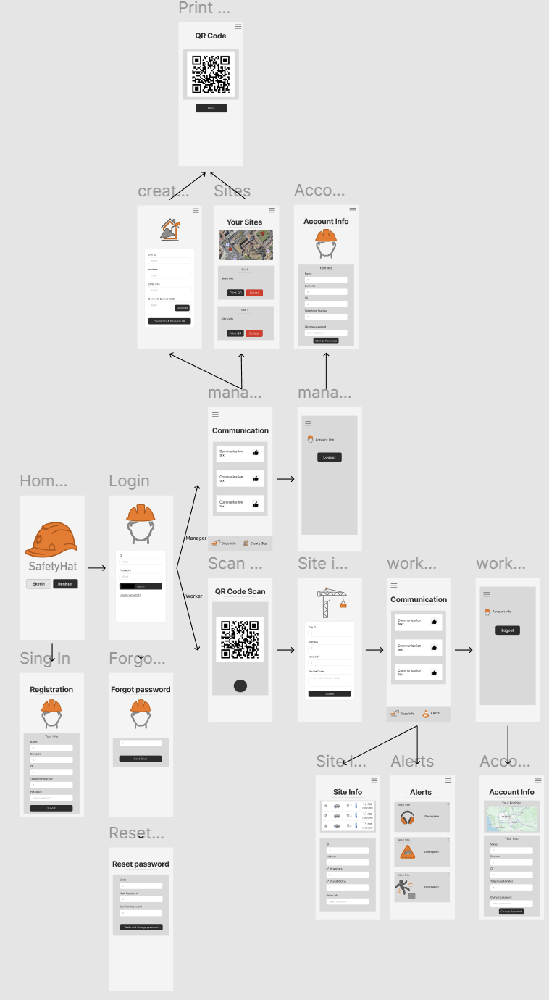

# SafetyHat

SafetyHat is an Android application designed to improve safety on construction sites. It provides dedicated functionalities for both **Managers** and **Workers**, helping companies manage sites effectively while ensuring worker safety through alerts, communications, and advanced tools.

---

## Application Flow

The application starts with a welcome screen where users can log in or register for an account. Once logged in, the system directs users to functionalities based on their roles: **Manager** or **Worker**.

### Manager Role

After logging in, Managers gain access to a dashboard where they can create and manage construction sites. Once created, the system automatically generates a unique QR code to allow worker access to the corresponding the site. This QR code can be printed directly into the gallery from the app.

Managers can also send communications to Workers associated with a specific site. These messages appear in the Workers' app interface, where Workers can interact by reacting (e.g., "liking" the messages). This interaction allows Managers to monitor Worker engagement and ensure important communications are acknowledged.

Additionally, Managers have the ability to view and manage their personal information directly within the app. They can also change their password to keep their account information up to date.

### Worker Role

After logging in, Workers access construction sites by scanning the QR code provided by the Manager. After scanning, the app prompts them to enter the secret code to confirm access. Once authenticated, Workers can view site details, including the address, Manager contact information, and any communication sent by the Manager.

In addition to managing communications, the app incorporates an advanced alert system to ensure Worker safety. Alerts are triggered under specific conditions:

1. **Weather Alerts**: Through integration with the AccuWeather API, the app monitors weather conditions. If adverse weather (e.g., storms or high winds) is detected, an alert is displayed both in the app and as a push notification to the Worker.

2. **Protective Equipment Reminders**: The app uses Google Maps geolocation services to detect when a Worker enters the radius of a construction site. At this point, a reminder is displayed, prompting the Worker to wear safety equipment.

3. **Excessive Noise Detection**: The app uses the device's microphone to monitor noise levels. If the decibel level exceeds a critical threshold, an alert notifies the Worker to prevent hearing damage.

4. **Fall Detection**: SafetyHat leverages the smartphone’s accelerometer and gyroscope to detect sudden movements indicative of a fall. If a fall is detected, the app automatically sends an emergency SMS to all Workers associated with the site. The message includes the GPS coordinates of the Worker involved, enabling swift assistance.

Workers also have access to two additional features:

- **SafetyHat Filter for Photos**: Workers can take photos with a SafetyHat filter that shows the helmet from the SafetyHat logo on their heads. This feature is implemented thanks to a face detection algorithm and 2D graphics tools.

- **Virtual Measuring Tool**: Workers can use an augmented reality-based virtual measuring tool. By pointing their camera on a surface and tapping on the screen to define points, the app calculates and displays the distance between the selected points.

## Mockups

Below is an image illustrating the application flow and UI design:

SafetyHat has been designed to provide a seamless user experience in both **portrait (vertical)** and **landscape (horizontal)** orientations. This flexibility ensures that the application is usable in various contexts, whether the user is holding their device vertically for quick access or horizontally.

## Architecture and Technologies

SafetyHat features a simple and intuitive user interface developed in Kotlin using Android Studio. Each functionality follows a logical, seamless flow to maximize daily usability.

The back end is powered by Flask, hosted on PythonAnywhere, and handles CRUD operations for sites, Managers, and Workers. A database stores core information, including user details, site data, and communications.

To enhance functionality, the application integrates several third-party APIs:
- **AccuWeather API**: Provides real-time, accurate weather data.
- **Google Maps API**: Manages maps and site geolocation services.

